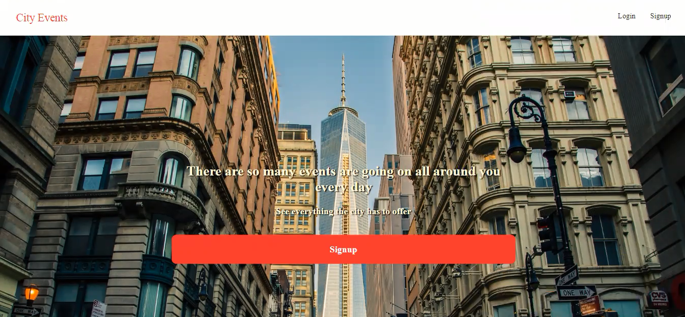
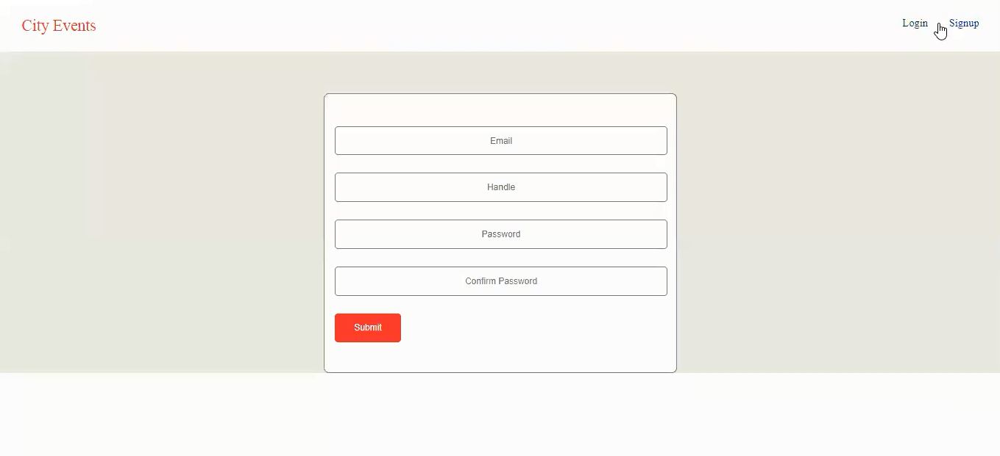
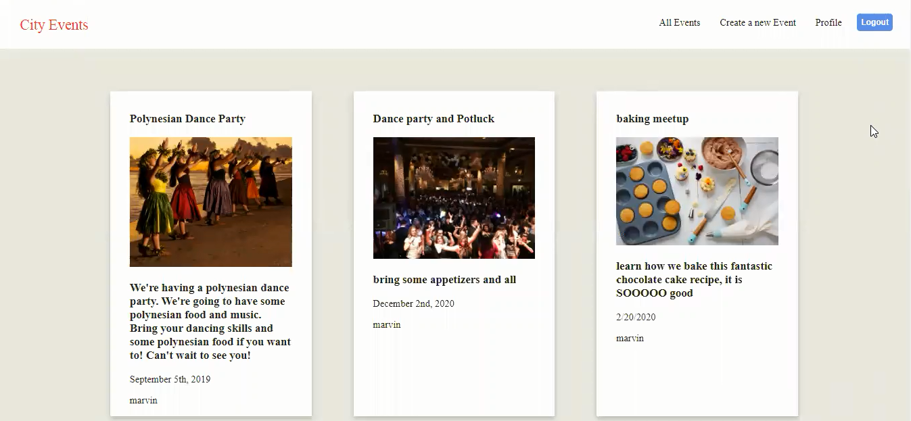
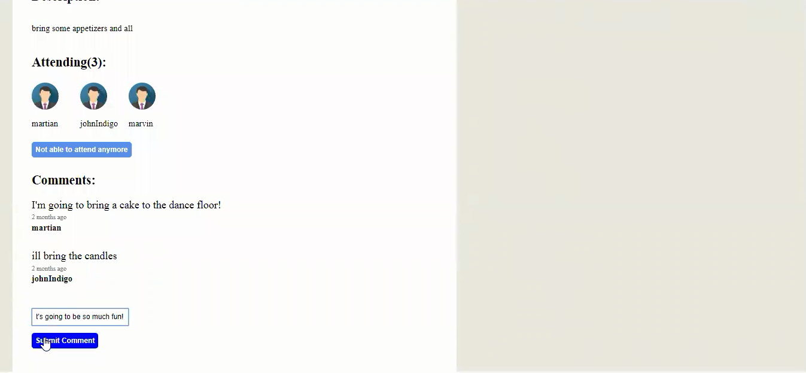

# City Events

[Video Demonstration](https://m.youtube.com/watch?v=3eSR9Ui8NHc)

This application lets users be able to browse and create events in their city. Users can add themselves to an event list to confirm attendance and leave comments.

This application was created with MongoDB, express,
React, Redux, and nodeJs.

## Flexbox

One of the challenges I faced was in getting the
events list to have each of the event boxes to be
equal in height. I used flexbox to fix this.

## Future Directions 

Create groups that a user can become a part of and have the group administrator approve or deny access.

